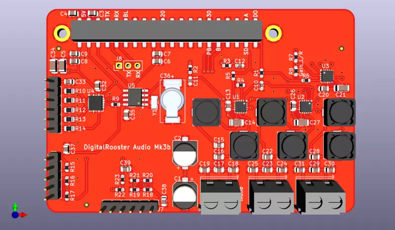

# Buildroot External structure for DigitalRoosterGui

Buildroot external for creating a root file system running [DigitalRoosterGui](https://github.com/truschival/DigitalRoosterGui)
as digital alarm clock.

This repository is part of a larger project. For more information head to
[www.digitalrooster.dev](https://www.digitalrooster.dev)

## Supported hardware

For detailed information on the hardware check out
[digitalrooster.dev/hardware](https://digitalrooster.dev/hardware).  This
software includes configurations for Raspberry Pi Zero W and Banana Pi M2
Zero. The Raspberry Pi port works great while Banana Pi is still under
development.  We have to figure out the performance issues i.e. why it takes
ages for the display to update after a touch event. I don't consider this port
production ready yet.

The device tree and kernel drivers include support for following hardware:

-   Adafruit [PiTFT2.8" capacitive touch](https://learn.adafruit.com/downloads/pdf/adafruit-2-8-pitft-capacitive-touch.pdf)

-   The [DigitalRooster-MK3B](www.digitalrooster.dev/mk3b) extension board which
    is compatible both Raspberry Pi *and* Banana Pi M2 Zero.
    -   Three Channel audio using a 3W MAX98357A I2S driver. Since this IC is a
        Class-D amp I equipped the channels with passive LC filter to improve
        audio quality. The left/right channels have a cut-off frequency of
        around 20kHz while the mid channel filter is a 16kHz low-pass

    -   a hardware shutdown line for the audio codecs so 'off' is really 'off'
        and there is no popping noise when changing tracks

    -   A BQ32000 Real Time Clock chip with trickle-charge circuit that charges
        a 200mF SuperCap. Although the software synchronizes time using NTP I
        wanted a Real Time Clock in case the network is down. Also having a the
        correct time during boot makes logging a lot more insightful and avoids
        TLS error for certificates that are not yet valid on Jan 1st of 1970...

    -   A TLC59208F PWM LED driver for backlight control and a possible RGBA
        light to wake up with a sunrise simulation. The PWM pins on both
        Raspberry Pi and BananaPi are scarce an used for other functions,
        e.g. I2S. Software PWM is not really a nice option so I was willing to
        spend some 2.5$ for a nice I2C chip that integrates nicely with the
        Linux LED driver framework

    -   Integrated circuitry for the Grayhill rotary encoder
        [61C11-01-08-02](http://lgrws01.grayhill.com/web1/images/ProductImages/I-21-22.pdf)
        that requires voltage dividers and a debounce for the push button

    -   The possiblity to connect an external I2C device. I have a APDS9660
        gesture and light sensor in mind for dynamic back-light control or
        gesture snooze.

Alternatively you can use the Adafruit [Speaker Bonnet with MAX98357 I2S
amp](https://cdn-learn.adafruit.com/downloads/pdf/adafruit-speaker-bonnet-for-raspberry-pi.pdf)
to get sound. It works with Raspberry Pi (but not BananaPi) and unfortunately
does not have a hardware shutdown pin.




---

## License

Copyright 2018 by Thomas Ruschival <thomas@ruschival.de>

Licensed under the GNU PUBLIC LICENSE Version 2. The license terms can be found
in the file [LICENSE](./LICENSE)

---
## Build Pre-requisites

-   [buildroot](https://buildroot.org/) installation
    `git clone git://git.buildroot.net/buildroot`

### Setup

``` sh
mkdir <build_tree>
make BR2_EXTERNAL=<local_clone_of_this_repo> -C<buildroot_installation_dir> \
     O=<build_tree> XXX_defconfig
cd <build_tree>
make menuconfig (optional)
```

**Tip:** in the build tree create a file ``local.mk`` where you can set
individual buildroot variables for your system like for instance the root
password. See [buildroot manual](https://buildroot.org/downloads/manual/manual.html#_advanced_usage)
Following example uses ccache, overrides the hostname, root password and
the source location for DigitalRoosterGui.

``` Makefile
BR2_CCACHE=y
BR2_CCACHE_DIR=$(HOME)/tmp/buildroot-ccache-bpim20
BR_CACHE_DIR=$(HOME)/tmp/buildroot-ccache-bpim20
BR2_TARGET_GENERIC_ROOT_PASSWD=foo
BR2_TARGET_GENERIC_HOSTNAME=bpim2zero
DIGITALROOSTERGUI_OVERRIDE_SRCDIR=/home/ruschi/Coding/DigitalRooster
```

### Target build configurations

Currently the following configurations (`XXX_defconfig`) for exist:
-   `rpi0w_defconfig` DigitalRooster on a Raspberry Pi Zero W
    (currently running at my bedside)

-   `bananapi_m2_zero_defconfig` DigitalRooster on a BananaPi M2 Zero
    ( *in development* )

#### Environment variables
Some properties that are very specific to your home such as wifi is configured
through environment variables.

##### Wifi Network configuration

``boards/common/post_build.sh`` has a hook to configure wifi network passwords.

Set the environment variable ``LOCAL_WIFI_NET_CFG`` to a file path containing
your wifi network configuration. The content of this file will be added
to ``/etc/wpa_supplicant.conf`` of your target file system.

##### Signed SWUpdate images (optional)

[SWUpdate](https://sbabic.github.io/swupdate/index.html) installed with
`rpi0w_defconfig` is configured to verify image signatures. Once compiled with
signed image verification this feature is no longer optional. This means if you
want to use sw-update images to update your DigitalRooster you have to create
signed images.

To do this you need a public certificate that is installed on DigitalRooster and
will be used by sw-update to verify your image. You will also need a private key
to sign your image.

These to files are passed to the build by two environment variables:
*  The variable `SWU_IMAGE_CERT_PATH` contains the path of the public
   certificate that will be installed in `/etc/ssl/certs/sw-update-cert.pem`
   used for validating signatures at runtime.
*  The environment variable `SWU_IMAGE_SIG_KEY_PATH` contains the path
   to a path of the private RSA key matching the public cert used for
   signing in the .swu file.

To create the key and the ceritficate follow the documentation of
[Update images from verified source](https://sbabic.github.io/swupdate/signed_images.html)


## Example for the whole build process

For the anxious and impatient among you here is a copy-and-paste runthrough.
The only thing I can't give you is the SSID and passphrase of your wifi...

1. Create a wpa_supplicant.conf fragment for the wifi-key and SSID

``` sh
mkdir digitalrooster
cd digitalrooster
export TOPDIR=$(pwd)

cat > $TOPDIR/my_wifi_conf << EOF
network={
    ssid="my_wifi_network_ssid"
    psk=081937e670bxxxxxxxxxxxxxxx43d
}
EOF
```

2. Checkout the repositories

``` sh
git clone git://git.buildroot.net/buildroot
git clone https://github.com/truschival/buildroot_digitalrooster.git
```

3. Create image signing keys and certificate (optional)

``` sh
# Create a unencrypted key (not recommended)
openssl genrsa -out $TOPDIR/swupdate-key.pem
export SWU_IMAGE_SIG_KEY_PAT=$TOPDIR/swupdate-key.pem
# Create the certificate for this key
openssl rsa -in swupdate-key.pem -out $TOPDIR/swupdate-pub-cert.pem -outform PEM -pubout
export SWU_IMAGE_CERT_PATH=$TOPDIR/swupdate-pub-cert.pem
```

3. Configure and build

``` sh
mkdir build-rpi0w
cd build-rpi0w
make BR2_EXTERNAL=$TOPDIR/buildroot_digitalrooster -C$TOPDIR/buildroot \
     O=$(pwd) rpi0w_defconfig

# this takes some time......
make
# copy image to sdcard
dd if=./images/sdcard.img of=/dev/sde bs=512

```
